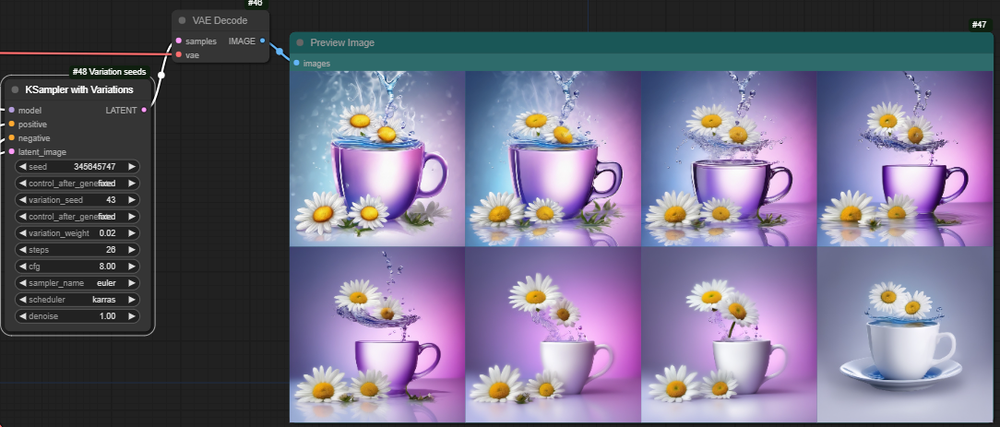
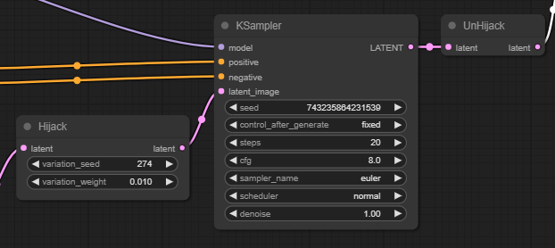

# KSamplers with variation seed (aka Noise Hijack)


Custom nodes that replace `KSampler` and `KSampler Advanced` (or hijack others - see below) and allow you to generate small variations in the initial noise.

Conceptually, `noise = random_based_on(seed)` is replaced with `noise = random_based_on(variation_seed) * x + random_based_on(seed) * (1-x)` for some weight `x`. `x=0` generates an identical image to the normal nodes, small values of `x` generate similar images.

|||||
|-|-|-|-|
|x=0|x=0.02|x=0.04|x=0.06|
|||||
|x=0.08|x=0.1|x=0.12|x=0.14|
|||||

## Updates

### 1.1 

- Main variation node now uses ContextManager to ensure noise function is always released
- Hijack nodes better at checking for inconsistent use
- Fixed saved workflows!

## Usage

Once installed,  Download this [example workflow](docs/workflow.json) and check it works. Note that the variations seem to behave differently with different samplers and schedulers, so you might need to play around with those settings. 

You can use the new nodes (found under *sampling* as `KSampler with Variations` and `KSampler Advanced with Variations` - for use with other KSamplers, see below) just like you use the original KSampler nodes, with

- `seed` is the seed for the original image
- `control_after_generated` is set to `fixed` by default
- `variation_seed` is the alternative seed
- `variation_weight` is the weight - typically quite small (try 0.1)

## Batch inputs

If the batch size is 1, the node will generate a single image with the specified *variation_weight*. 

If the batch size is larger than 1, the node will generate a set of images all based on the same
original noise. The first image will have *variation_weight* of zero, the second will have *variation_weight* as set in the node, the third will have *variation_weight* of 2x the value set in the node, the fourth will have 3x etc..

Note that the way some samplers work means that batches don't really work like you'd expect. So if you have issues with batches, try other samplers! 



Or download a workflow using any of the images in the example at the top.

## Other KSamplers

There are two custom nodes under noise/hijack. Place the `Hijack` node directly before your KSampler, and the `Unhijack` node directly after it. Set *control_after_generate* to *fixed*. Like this, but with your KSampler:



## SDXL Note

If you use the refiner, the noise is added by the first KSampler, so that's where you do the variations. Using the variations node on the second KSampler (where *add_noise* is disabled) doesn't do anything.


## Installation

Use the [ComfyUI Manager](https://github.com/ltdrdata/ComfyUI-Manager) and search for chrisgoringe or variation.

Manual install:
```
cd [Comfy Install]/custom_nodes
git clone https://github.com/chrisgoringe/cg-noise.git
git clone https://github.com/chrisgoringe/cg-custom-core.git cg_custom_core
```
Then restart ComfyUI and reload the webpage.

## Update

Use the [ComfyUI Manager](https://github.com/ltdrdata/ComfyUI-Manager)

Manual:
```
cd [Comfy Install]/custom_nodes/cg-noise
git pull
cd [Comfy Install]/custom_nodes/cg_custom_core
git pull
```
Then restart ComfyUI and reload the webpage.
