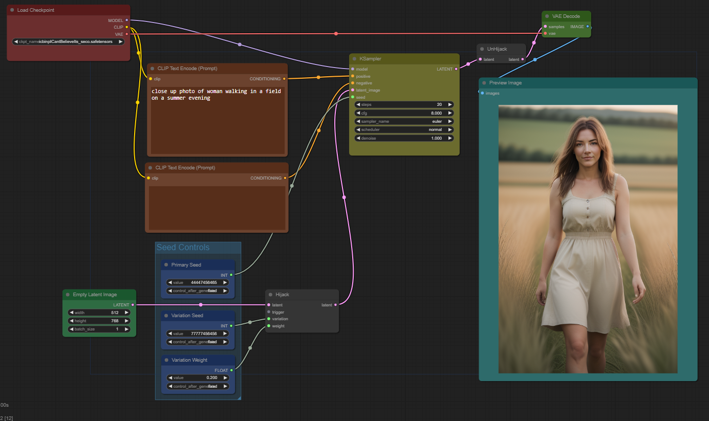
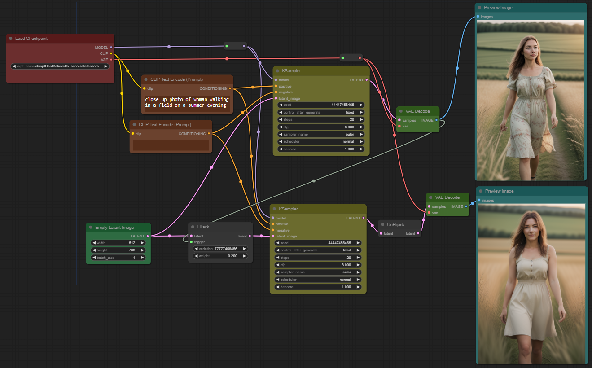

# Noise Hijack

[Index of all my custom nodes](https://github.com/chrisgoringe/cg-nodes-index)

Here's a simple pair of custom nodes that allows you to generate small variations (a bit like A1111's subseed). They work by hijacking the noise generator used by the KSampler, effectively replacing

```python
noise = random_based_on(seed)
```

with 

```python
noise = random_based_on(seed) * (1-x)  +  random_based_on(another_seed) * x
```

The first node does the hijack (and has parameters to determine the values of `another_seed` and the weight, `x`), and the other node undoes it. They take latent as input and output but they don't actually do anything to it; that's just a good way to make sure they get executed before and after the KSampler.

Here's a simple txt2img workflow and an image you can drop into ComfyUI

|Screenshot|Dropable image|
|-|-|
|||

And here's one which compares the results with and without variation

|Screenshot|Dropable image|
|-|-|
| ||

## Trigger? What's that?

Maybe you noticed that the Hijack node has an input labelled 'trigger'. This is there in case you need to control when the hijack takes place - so in the case of the second workflow, it's important that the hijack doesn't happen before the first KSampler runs (because - important point - the hijack is global). Plug anything you like into the trigger, and the hijack won't run until the node upstream has finished. So in this case, it ensures the first image is completed before the hijack takes place.